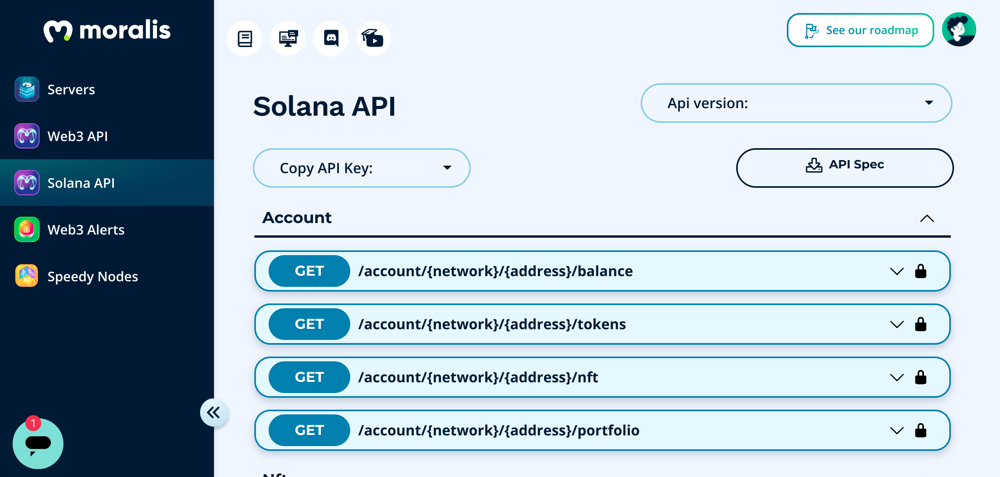
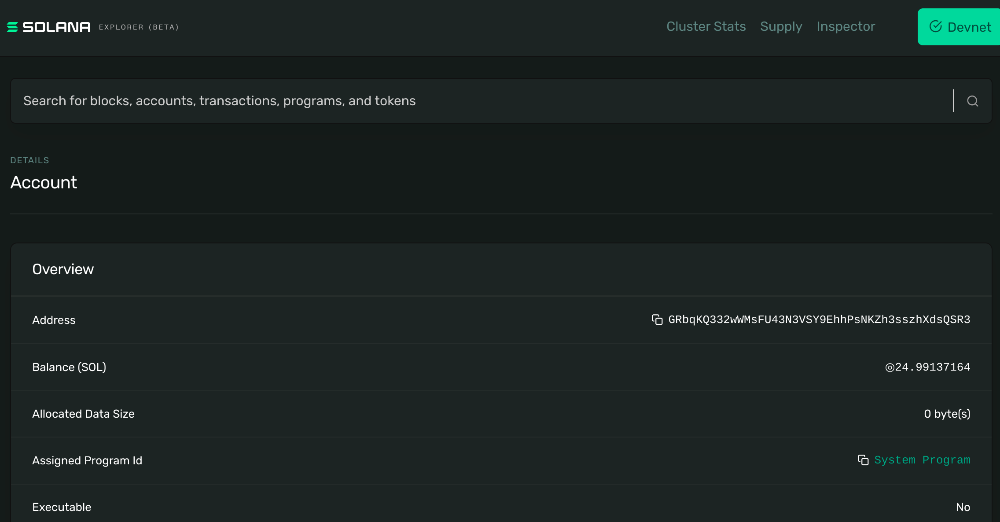
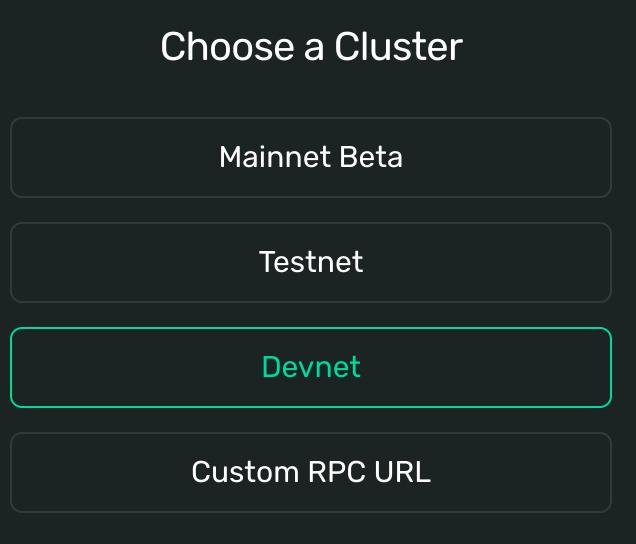
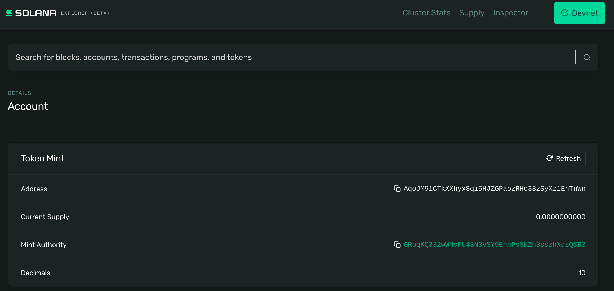
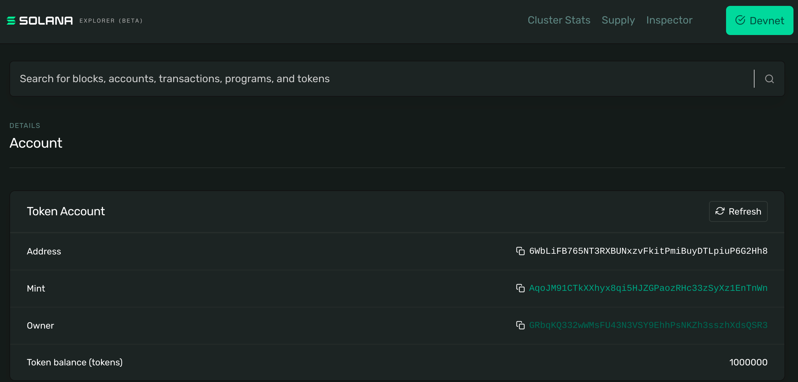
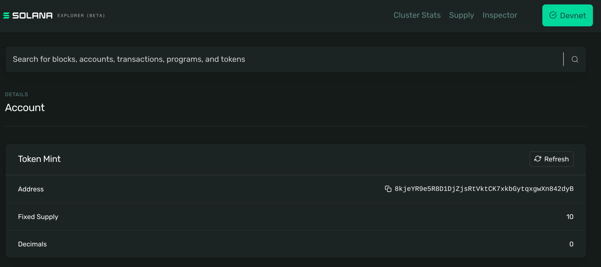
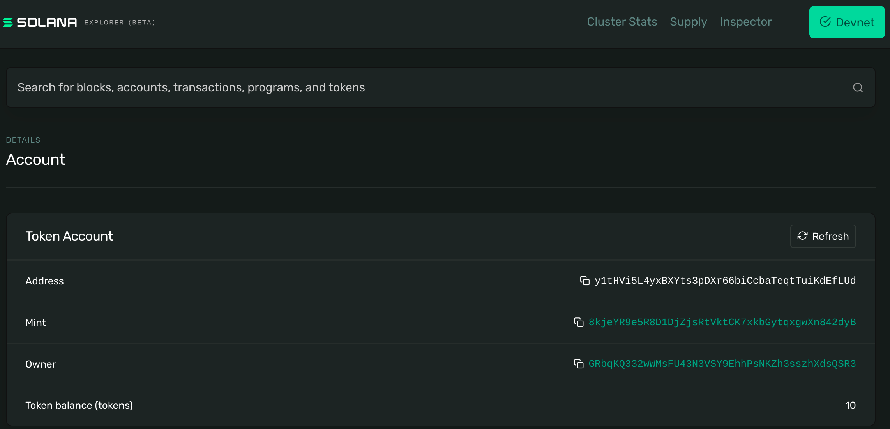

# Solana NFT


## TODO List

- Check allowance
- Allow Permissions
- Listening to Events
- Write a Program in Rust
- Deploy the Program
- NFT URI
- Check account transactions
- Wormhole/Vortex
- Neon

## Table of Contents

- [References](#references)
- [Running a Validator](#running-a-validator)
- [Installation](#installation)
- [Connecting a Wallet](#connecting-a-wallet)
- [Creating a Token](#creating-a-token)
- [Creating an NFT](#creating-an-nft)
- [Listing the Token](#listing-the-token)
- [Allowing other Accounts](#allowing-other-accounts)

## References

- [Getting Started with MetaPlex](https://docs.metaplex.com/token-metadata/getting-started)
- [File System Wallet](https://docs.solana.com/wallet-guide/file-system-wallet)
- [Install the Solana Tool Suite](https://docs.solana.com/cli/install-solana-cli-tools)
- [How To Transfer Eth Assets to Solana Using Wormhole ](https://blog.mercurial.finance/how-to-transfer-eth-assets-to-solana-using-wormhole-v2-514e728dc4fc)
- [Neon](https://docs.neon-labs.org/docs/intro)

## Installation

#### [Python SDK](https://michaelhly.github.io/solana-py/)

Installing the SDK is not recommended. It is just a wrapper for the OS `solana-cli` which captures the output on STDOUT and transforms it into Python code. However, if the `solana-cli` version is incompatible, it does not work properly.

#### [moralis.io](https://moralis.io/moralis-releases-solana-api/)

It can can be used to interact with the Blockchain. For example:
```bash
curl -X GET "https://solana-gateway.moralis.io/account/devnet/GRbqKQ332wWMsFU43N3VSY9EhhPsNKZh3sszhXdsQSR3/balance?cluster=devnet" -H "X-Api-Key: sBpG7zBJbKgI7DXHUWnqYxxgWveqpoQZ0mbCqti0SnfV7GQxyoKneiIGyd9lMx4q"
```
```bash
{
    "lamports":"24982265600",
    "solana":"24.9822656"
}
```



#### Install the Solana release v1.9.8 on your machine:
```bash
curl --proto '=https' --tlsv1.2 -sSf https://sh.rustup.rs | sh
```

#### Confirm you have the desired version of solana installed:
```bash
solana --version
```
```bash
solana-cli 1.9.8 (src:4ebeb336; feat:2191737503)
```

## Running a Validator

There is no need to run our own validator.

## Connecting a Wallet

#### Use Solana's command-line tool solana-keygen to generate keypair files
```bash
solana-keygen new --outfile key.json
```
```bash
Generating a new keypair
[...]
Wrote new keypair to key.json
=============================================================================
pubkey: GRbqKQ332wWMsFU43N3VSY9EhhPsNKZh3sszhXdsQSR3
=============================================================================
Save this seed phrase and your BIP39 passphrase to recover your new keypair:
mixture code leopard relax nice debris truth close differ hurry donor balcony
=============================================================================
```

#### Retrieve the private key from the json file
```bash
cat key.json
```
```bash
[41,88,225,51,18,0,227,73,125,103,15,76,72,117,150,92,125,181,75,247,58,25,210,119,4,84,64,158,138,249,239,209,229,44,161,17,139,218,26,171,96,204,62,111,122,15,174,13,108,108,173,221,27,98,122,203,2,74,235,143,157,13,195,174]
```

#### Verify you hold the private key for a given address
```bash
solana-keygen verify GRbqKQ332wWMsFU43N3VSY9EhhPsNKZh3sszhXdsQSR3 key.json
```
```bash
Verification for public key: GRbqKQ332wWMsFU43N3VSY9EhhPsNKZh3sszhXdsQSR3: Success
```

#### Set the local environment to authenticate its requests with the new wallet
```bash
solana config set --keypair key.json 
```
```bash
Config File: /home/martinalejandrocastroalvarez/.config/solana/cli/config.yml
RPC URL: https://api.mainnet-beta.solana.com 
WebSocket URL: wss://api.mainnet-beta.solana.com/ (computed)
Keypair Path: key.json 
Commitment: confirmed 
```

#### Add SOL to your wallet on devnet
```bash
solana airdrop 1 GRbqKQ332wWMsFU43N3VSY9EhhPsNKZh3sszhXdsQSR3 
```
```bash
Signature: 2RkG5e9TZozHQFVqGBaB5pwpSwo1CEiZYud4C5BwFSybN3S8gjQp41hUBqQ533fa7WcLukP5uHE9SnB9e86Ni8Nu
```

#### Open the wallet on the Solana explorer

- [mainet](https://explorer.solana.com/address/GRbqKQ332wWMsFU43N3VSY9EhhPsNKZh3sszhXdsQSR3)
- [devnet](https://explorer.solana.com/address/GRbqKQ332wWMsFU43N3VSY9EhhPsNKZh3sszhXdsQSR3?cluster=devnet)



#### Connect to the devnet cluster
```bash
solana config set --url devnet
```
```bash
Config File: /home/martinalejandrocastroalvarez/.config/solana/cli/config.yml
RPC URL: https://api.devnet.solana.com 
WebSocket URL: wss://api.devnet.solana.com/ (computed)
Keypair Path: key.json 
Commitment: confirmed 
```



## Creating a Token

#### Create a new token
```bash
spl-token create-token --decimals 10
```
```bash
Creating token AqoJM91CTkXXhyx8qi5HJZGPaozRHc33zSyXz1EnTnWn 
Signature: 44CPkEej8Mz2okM41673XGWDmARpykn7gfFEzySSmj51vhYivmwkJycCVV1Xdno3MzexQQF5u8XK1e5fkbRhEmnd
```

#### Open the new token on the Solana explorer

- [mainet](https://explorer.solana.com/address/AqoJM91CTkXXhyx8qi5HJZGPaozRHc33zSyXz1EnTnWn)
- [devnet](https://explorer.solana.com/address/AqoJM91CTkXXhyx8qi5HJZGPaozRHc33zSyXz1EnTnWn?cluster=devnet)



#### Create an account on your wallet to hold the NFT
```bash
spl-token create-account AqoJM91CTkXXhyx8qi5HJZGPaozRHc33zSyXz1EnTnWn
```
```bash
Creating account 6WbLiFB765NT3RXBUNxzvFkitPmiBuyDTLpiuP6G2Hh8
Signature: 2JDWfThLe8dN1sCPvn8pUuwAgfH3ZLVnjW741pvvr3xiwSvWxtWoCGDxt3zzsCCNFMxhPyDrAY6Q5WoxwWw1dXUN
```
Trying to create multiple accounts for the same token generates the following error:
```bash
Creating account 6WbLiFB765NT3RXBUNxzvFkitPmiBuyDTLpiuP6G2Hh8
Error: Account already exists: 6WbLiFB765NT3RXBUNxzvFkitPmiBuyDTLpiuP6G2Hh8
```

#### Mint token
```bash
spl-token mint AqoJM91CTkXXhyx8qi5HJZGPaozRHc33zSyXz1EnTnWn 1000000
```
```bash
Minting 1000000 tokens
  Token: AqoJM91CTkXXhyx8qi5HJZGPaozRHc33zSyXz1EnTnWn
  Recipient: 6WbLiFB765NT3RXBUNxzvFkitPmiBuyDTLpiuP6G2Hh8
```

#### Disable minting to set the token supply
```bash
spl-token authorize AqoJM91CTkXXhyx8qi5HJZGPaozRHc33zSyXz1EnTnWn mint --disable
```
```bash
Updating AqoJM91CTkXXhyx8qi5HJZGPaozRHc33zSyXz1EnTnWn
  Current mint authority: GRbqKQ332wWMsFU43N3VSY9EhhPsNKZh3sszhXdsQSR3
  New mint authority: disabled
```

#### Check the token supply
```bash
spl-token supply AqoJM91CTkXXhyx8qi5HJZGPaozRHc33zSyXz1EnTnWn
```
```bash
300
```

#### Check your balance
```bash
spl-token balance AqoJM91CTkXXhyx8qi5HJZGPaozRHc33zSyXz1EnTnWn
```
```bash
1000000
```

#### Open the account on the Solana explorer to check your balance

- [mainet](https://explorer.solana.com/address/6WbLiFB765NT3RXBUNxzvFkitPmiBuyDTLpiuP6G2Hh8)
- [devnet](https://explorer.solana.com/address/6WbLiFB765NT3RXBUNxzvFkitPmiBuyDTLpiuP6G2Hh8?cluster=devnet)



## Creating an NFT 

#### Create the new NFT
```bash
spl-token create-token --decimals 0
```
```bash
Creating token 8kjeYR9e5R8D1DjZjsRtVktCK7xkbGytqxgwXn842dyB
Signature: 45bawtJRWxLRcPRqnqe2mxsmXosnnR3wfXi2kFntppYZzTe8naphHH5yLLiWz7mx528NkqUwUiEafkmF1uTwXJdj
```

#### Create an account on your wallet to hold the NFT
```bash
spl-token create-account 8kjeYR9e5R8D1DjZjsRtVktCK7xkbGytqxgwXn842dyB
```
```bash
Creating account y1tHVi5L4yxBXYts3pDXr66biCcbaTeqtTuiKdEfLUd
Signature: 4LgztnskmdowCN7tnKsXkfP3r39dyqfnS7RmByXFbFHNwyFrPHx6kKKefR5YHcRFrWb7H6GpiBZFFwqJioZqXWrh
```

#### Mint 10 editions
```bash
spl-token mint 8kjeYR9e5R8D1DjZjsRtVktCK7xkbGytqxgwXn842dyB 10
```
```bash
Minting 10 tokens
  Token: 8kjeYR9e5R8D1DjZjsRtVktCK7xkbGytqxgwXn842dyB
  Recipient: y1tHVi5L4yxBXYts3pDXr66biCcbaTeqtTuiKdEfLUd
```

#### Disable minting to set the token supply
```bash
spl-token authorize 8kjeYR9e5R8D1DjZjsRtVktCK7xkbGytqxgwXn842dyB mint --disable
```
```bash
Updating 8kjeYR9e5R8D1DjZjsRtVktCK7xkbGytqxgwXn842dyB
  Current mint authority: GRbqKQ332wWMsFU43N3VSY9EhhPsNKZh3sszhXdsQSR3
  New mint authority: disabled
```

#### Open the NFT on the Solana explorer

- [mainet](https://explorer.solana.com/address/8kjeYR9e5R8D1DjZjsRtVktCK7xkbGytqxgwXn842dyB)
- [devnet](https://explorer.solana.com/address/8kjeYR9e5R8D1DjZjsRtVktCK7xkbGytqxgwXn842dyB?cluster=devnet)



#### Check your balance
```bash
spl-token balance 8kjeYR9e5R8D1DjZjsRtVktCK7xkbGytqxgwXn842dyB
```
```bash
10
```

#### Check your portfolio
```bash
spl-token accounts 
```
```bash
Token                                         Balance
---------------------------------------------------------------
8kjeYR9e5R8D1DjZjsRtVktCK7xkbGytqxgwXn842dyB  9      
AqoJM91CTkXXhyx8qi5HJZGPaozRHc33zSyXz1EnTnWn  1000000
C9r7VaDTBrgm8vPFB7BCjEVhXD3kW5vRT2PEgezdyjNQ  220300 
CNwdEBCLHJN5sUDwydDMjJdKmNA88KSi16N4pFuxbsNL  0      
```

#### Open the account on the Solana explorer to check your balance

- [mainet](https://explorer.solana.com/address/y1tHVi5L4yxBXYts3pDXr66biCcbaTeqtTuiKdEfLUd)
- [devnet](https://explorer.solana.com/address/y1tHVi5L4yxBXYts3pDXr66biCcbaTeqtTuiKdEfLUd?cluster=devnet)



#### Listing the Token

#### Clone the the [Token List](https://github.com/solana-labs/token-list) repository
```bash
git clone https://github.com/solana-labs/token-list
cd token-list/
```

#### Add the media to the logos directory
```bash
mkdir assets/mainnet/AqoJM91CTkXXhyx8qi5HJZGPaozRHc33zSyXz1EnTnWn/
cp ~/Downloads/logo.png assets/mainnet/AqoJM91CTkXXhyx8qi5HJZGPaozRHc33zSyXz1EnTnWn/logo.png
git add assets/mainnet/AqoJM91CTkXXhyx8qi5HJZGPaozRHc33zSyXz1EnTnWn/logo.png
```

#### Add your token to the token list
To add a new token, add another json block to the large tokens list in `src/tokens/solana.tokenlist.json` and submit a PR.
```bash
vim src/tokens/solana.tokenlist.json 
```
```bash
    {
      "chainId": 101,
      "address": "AqoJM91CTkXXhyx8qi5HJZGPaozRHc33zSyXz1EnTnWn",
      "symbol": "NISMAN",
      "name": "Nisman Coin",
      "decimals": 10,
      "logoURI": "https://github.com/MartinCastroAlvarez/ethereum-solidity-contract/raw/main/logo.png",      "tags": [
        "solana"
      ],
      "extensions": {
        "website": "https://github.com/MartinCastroAlvarez/ethereum-solidity-contract"
      }
    },
```

#### Commit your changes and submit a pull request.
```bash
git commit -a -m 'Adding MP token'
git checkout -b MartinCastroAlvarezNisman
git push origin MartinCastroAlvarezNisman
```

#### Transferring tokens

#### Create another wallet 
```bash
solana-keygen new --outfile other.json
```
```bash
Generating a new keypair
For added security, enter a BIP39 passphrase
NOTE! This passphrase improves security of the recovery seed phrase NOT the
keypair file itself, which is stored as insecure plain text
BIP39 Passphrase (empty for none): 
Enter same passphrase again: 
Wrote new keypair to other.json
================================================================================
pubkey: AxHmduv298YFHUi6eTRhoXAWVdmEsRD4i44Ce9kD8ipv
================================================================================
Save this seed phrase and your BIP39 passphrase to recover your new keypair:
during wheat disorder pepper maple wise number together laptop poet narrow trend
================================================================================
```

#### Retrieve the private key from the json file
```bash
cat other.json
```
```bash
[53,55,82,181,90,137,126,208,219,71,54,77,119,145,77,88,5,103,208,217,10,218,187,210,47,131,48,215,123,226,223,110,147,227,22,153,66,69,41,186,253,0,224,158,116,81,90,102,12,218,125,243,30,144,25,89,122,152,197,55,190,90,78,215]
```

#### Create an account for the other account
```bash
spl-token create-account 8kjeYR9e5R8D1DjZjsRtVktCK7xkbGytqxgwXn842dyB --owner other.json
```
```bash
Creating account Cfm1v2s18DR9hKFD8diGNnT51tvGgvtgiN31RByML2qQ
Signature: UhR64tVJzEWPvAsVJJCnAKV7nSgc7ZMrPGyt28sYEKv26hGhjp8j7jK4wDAcif5BEKx5HvApSA6HdE4sqTGyfD3
```

#### Transfer a release into the new account
```bash
spl-token transfer 8kjeYR9e5R8D1DjZjsRtVktCK7xkbGytqxgwXn842dyB 1 Cfm1v2s18DR9hKFD8diGNnT51tvGgvtgiN31RByML2qQ
```
```bash
Transfer 1 tokens
  Sender: y1tHVi5L4yxBXYts3pDXr66biCcbaTeqtTuiKdEfLUd
  Recipient: Cfm1v2s18DR9hKFD8diGNnT51tvGgvtgiN31RByML2qQ
```

#### Check the new balance
```bash
spl-token balance 8kjeYR9e5R8D1DjZjsRtVktCK7xkbGytqxgwXn842dyB
```
```bash
9
```
```bash
spl-token balance 8kjeYR9e5R8D1DjZjsRtVktCK7xkbGytqxgwXn842dyB --owner AxHmduv298YFHUi6eTRhoXAWVdmEsRD4i44Ce9kD8ipv
```
```bash
1
```

#### Allow another account to transfer the NFT on your behalf
```bash
spl-token approve Cfm1v2s18DR9hKFD8diGNnT51tvGgvtgiN31RByML2qQ 1 y1tHVi5L4yxBXYts3pDXr66biCcbaTeqtTuiKdEfLUd --owner other.json
```
```bash
Approve 1 tokens
  Account: Cfm1v2s18DR9hKFD8diGNnT51tvGgvtgiN31RByML2qQ
  Delegate: y1tHVi5L4yxBXYts3pDXr66biCcbaTeqtTuiKdEfLUd
```

#### Use your approval to transfer the NFT on behalf of the other account
```bash
spl-token transfer 8kjeYR9e5R8D1DjZjsRtVktCK7xkbGytqxgwXn842dyB 1 y1tHVi5L4yxBXYts3pDXr66biCcbaTeqtTuiKdEfLUd 
```
```bash
Approve 1 tokens
  Account: Cfm1v2s18DR9hKFD8diGNnT51tvGgvtgiN31RByML2qQ
  Delegate: y1tHVi5L4yxBXYts3pDXr66biCcbaTeqtTuiKdEfLUd
```

Creating account 6WbLiFB765NT3RXBUNxzvFkitPmiBuyDTLpiuP6G2Hh8
Creating account y1tHVi5L4yxBXYts3pDXr66biCcbaTeqtTuiKdEfLUd
Creating account Cfm1v2s18DR9hKFD8diGNnT51tvGgvtgiN31RByML2qQ


## Allowing other Accounts

- [Solana allowing other wallet to mint or transfer token from my wallet](https://stackoverflow.com/questions/70862412/solana-allowing-other-wallet-to-mint-or-transfer-token-from-my-wallet)

